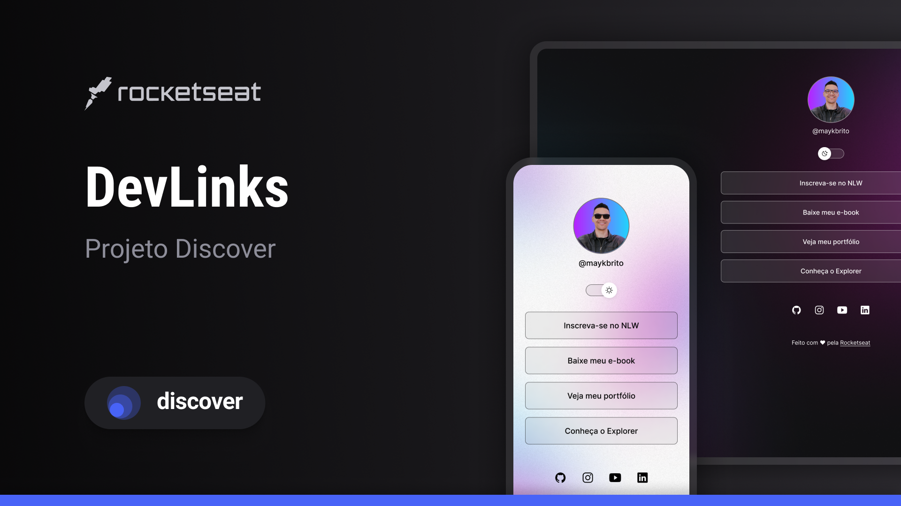

  

## 💻 Projeto

Projeto do curso devlinks para aprender html, css, javascript, git & github!

## ✨ Tecnologia

- [HTML](https://www.devmedia.com.br/o-que-e-o-html5/25820)
- [CSS](https://www.w3schools.com/css/)
- [JavaScript](https://www.javascript.com/)
- [Git](https://git-scm.com/)
- [Github](https://github.com/)

## 🚀 Como executar

Em todos os projetos, ao acessar a pasta, é preciso baixar os pacotes com o gerenciador de sua preferencia.

## 🔖 Layout

Você pode visualizar o layout do projeto através do link abaixo:

- [Layout](https://www.figma.com/community/file/1169028343875283461)

Lembrando que você precisa ter uma conta no [Figma](http://figma.com/).

## 📝 License

Esse projeto está sob a licença MIT. Veja o arquivo [LICENSE](LICENSE) para mais detalhes.

---

  Feito com 💜 by Rocketseat

  <a href="https://discord.gg/rocketseat">👉 Participe da nossa comunidade 👈</a>

<!--START_SECTION:footer-->

 
 

  

<!--END_SECTION:footer-->
